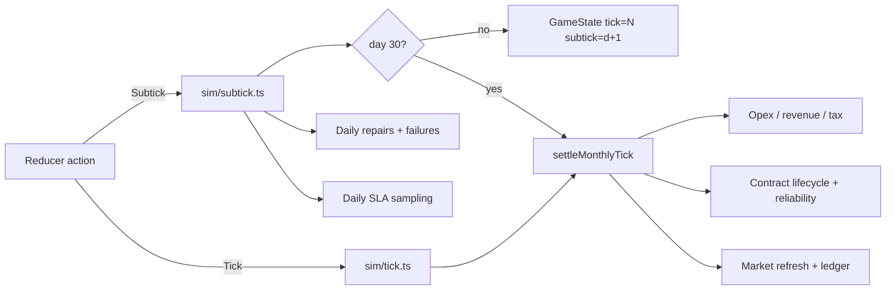
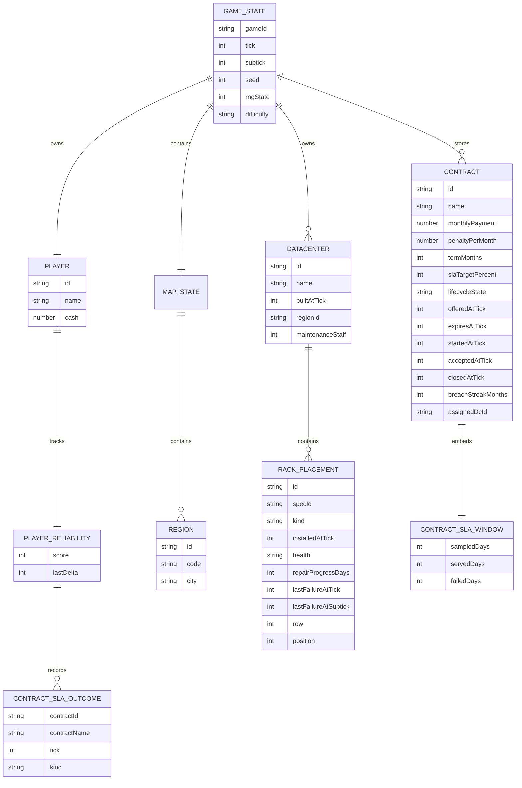
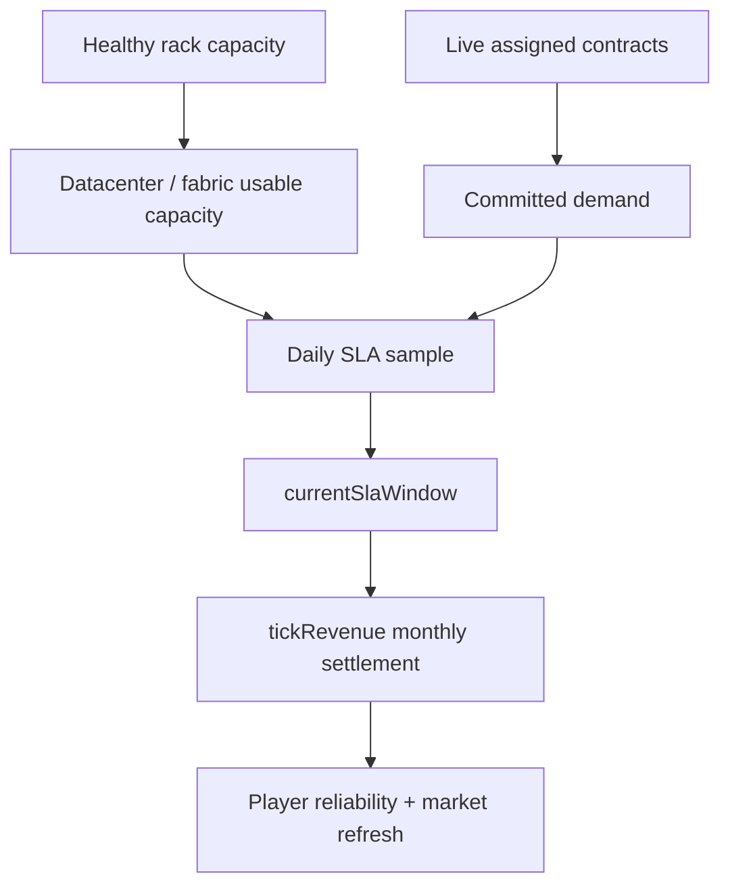

# Game Logic Architecture

This document explains how `@datacenter-tycoon/game-logic` is structured internally, which entities own which data, and how the main subsystems depend on each other.

For the time-progression pipeline, see [`./CORE_LOOP.md`](./CORE_LOOP.md).

## Design principles

The package is built around a few strict architectural rules:

- **`GameState` is the root aggregate**. Everything important to gameplay is persisted under it.
- **Simulation is deterministic**. All randomness flows through the seeded RNG in `src/sim/rng.ts`.
- **Catalogs are static data**. Blueprint-style definitions live in `src/catalog/`.
- **Derived views stay derived**. Capacity, rack activity, reliability outcomes, contract buckets, SLA summaries, and maintenance summaries are recomputed from canonical state instead of being reimplemented in consumers.
- **State transitions are centralized**. Player commands go through `src/state/reduce.ts`; time progression goes through `src/sim/subtick.ts` and `src/sim/tick.ts`.

## Subsystem responsibilities

| Area | Files | Responsibility |
| --- | --- | --- |
| Shared types | `src/types.ts` | Canonical shapes for persisted state and derived views |
| Catalogs | `src/catalog/*` | Static datacenter, rack, and region blueprints |
| Balance | `src/balance/*` | Difficulty, maintenance, power, reliability, and easing constants |
| Entities | `src/entities/*` | Placement validation, capacity aggregation, regional resource checks |
| Contracts | `src/contracts/*` | Offer generation, acceptance, lifecycle, SLA windows, reliability outcomes |
| Economy | `src/economy/*` | Capex, move costs, opex, power billing, monthly revenue |
| Simulation | `src/sim/*` | RNG, map generation, daily subticks, maintenance/failure simulation, monthly settlement |
| State | `src/state/*` | `newGame()` factory and reducer-based command handling |
| Save/load | `src/save/*` | Versioned JSON serialization |

## Time model

The core now uses a two-layer time model:

- `tick`: completed months
- `subtick`: completed days within the current month (`0..DAYS_PER_TICK - 1`)

This split is deliberate:

- **daily subticks** handle volatile operational state that should resolve inside a month
- **monthly settlement** handles expensive bookkeeping and market work that should stay month-scoped

## Dependency direction

At a high level, the package is layered like this:

1. **`types`** defines the shared language.
2. **`catalog`** and **`balance`** provide static inputs.
3. **`entities`** derives capacities/usages and validates physical constraints.
4. **`contracts`** and **`economy`** use those entity helpers to model business behavior.
5. **`sim`** orchestrates daily and monthly changes across maintenance, contracts, economy, and RNG.
6. **`state`** is the gameplay command surface that calls into the lower layers.
7. **`save`** persists the resulting `GameState`.

In practical terms:

- `state/reduce.ts` is the command router for build/place/move/accept/cancel/tick/subtick actions.
- `sim/subtick.ts` is the daily operational loop.
- `sim/tick.ts` owns compatible month advancement and month-end settlement.
- `contracts/lifecycle.ts` is the canonical contract classification layer.
- `contracts/sla.ts` owns SLA defaults, sampling helpers, and progress summaries.
- `economy/opex.ts` is the canonical monthly money calculation layer.
- `entities/datacenter.ts` and `query/datacenters.ts` remain the canonical physical-capacity and maintenance summary layer.

## Canonical persisted entity graph

The main persisted object graph looks like this:

### Important ownership notes

- **`GameState.contracts` is the canonical contract collection.**
  - `contractMarket` and `activeContracts` remain compatibility views maintained by `withDerivedContractViews()`.
- **`GameState.subtick` is persisted.**
  - Save/load must preserve mid-month state so replay determinism survives serialization.
- **Contract SLA state is persisted on the contract itself.**
  - `slaTargetPercent` describes the expected uptime threshold.
  - `currentSlaWindow` accumulates served/failed daily samples for the current month.
- **Rack failure history is day-precise.**
  - `lastFailureAtTick` + `lastFailureAtSubtick` give canonical failure timing.

## Capacity, SLA, and commitment relationships

The most important gameplay relationship is now the one between healthy rack supply, committed live demand, and the daily SLA window.

That relationship is implemented through canonical helpers such as:

- `datacenterCapacity(datacenter)`
- `summarizeFabricCapacityForDatacenter(state, dcId)`
- `sampleContractSlaWindows(state, contracts)`
- `summarizeContractSlaProgress(contract)`
- `tickRevenue(state)`

This keeps daily SLA math, monthly settlement, and UI presentation on the same source of truth.

## Runtime command architecture

There are two main entrypoints into the model:

### 1. Player-driven actions: `reduce(state, action)`

`src/state/reduce.ts` is the command layer for build/place/move/accept/cancel/settings actions plus time actions:

- `{ type: "Subtick" }`
- `{ type: "Tick" }`

The reducer does not duplicate domain rules. It delegates to lower-level helpers such as:

- `acceptContract()`
- `advanceSubtick()`
- `tick()`
- placement and capacity helpers

### 2. Time-driven progression: `advanceSubtick(state)` and `tick(state)`

- `advanceSubtick(state)` owns daily repairs, failures, and SLA sampling.
- `tick(state)` is the compatibility surface for “advance one month”, including from mid-month states.
- `settleMonthlyTick(state)` performs the heavy monthly bookkeeping once the day boundary reaches the end of the month.

## Module deep dives

If you need to understand a specific architectural concern, start here:

- **Root state and canonical entities**: `src/types.ts`
- **Action flow / command entrypoint**: `src/state/reduce.ts`
- **Initial world construction**: `src/state/newGame.ts`
- **Daily operational loop**: `src/sim/subtick.ts`
- **Monthly settlement**: `src/sim/tick.ts`
- **Placement and capacity rules**: `src/entities/datacenter.ts`
- **Contract lifecycle and selectors**: `src/contracts/lifecycle.ts`
- **Contract SLA defaults, sampling, and summaries**: `src/contracts/sla.ts`
- **Opex, power billing, and monthly revenue math**: `src/economy/opex.ts`
- **Aging and repair logic**: `src/sim/maintenance.ts`
- **Persistence shape**: `src/save/serialize.ts`

## Architectural guardrail

If a change adds time-based behavior, decide first whether it is:

- **daily operational state** → `sim/subtick.ts`
- **monthly financial / market state** → `sim/tick.ts`

That separation is the main reason subticks exist, and future work should preserve it.