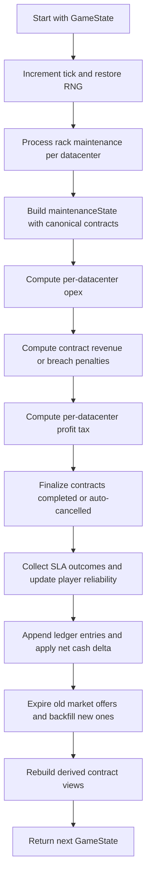

# Core Loop

This document explains what happens in one monthly simulation tick inside `src/sim/tick.ts`.

For the static entity model and module responsibilities, see [`./ARCHITECTURE.md`](./ARCHITECTURE.md).

## What a tick means

In `game-logic`, **1 tick = 1 in-game month**.

Time advancement can happen either by:

- calling `tick(state)` directly, or
- dispatching `{ type: "Tick" }` through `reduce(state, action)`.

## High-level tick pipeline



## Step-by-step

## 1. Advance time and restore deterministic RNG

`tick()` starts by computing:

- `nextTick = state.tick + 1`
- `rng = rngFromState(state.rngState)`

This means the tick consumes randomness from the persisted RNG stream instead of using `Math.random()`.

## 2. Run rack maintenance/failure simulation first

Each datacenter is processed by `processRackMaintenance()`.

For each rack placement:

- if the rack is already **`repairing`**:
  - advance repair progress with `advanceRackRepair()`
  - repair speed depends on `maintenanceStaff`
- otherwise, if the rack is **healthy**:
  - compute age with `rackAgeMonths(nextTick, placement)`
  - compute failure probability with `rackFailureChance(ageMonths, difficulty)`
  - roll the seeded RNG
  - on failure, mark the rack as:
    - `health: "repairing"`
    - `repairProgressDays: 0`
    - `lastFailureAtTick: nextTick`

### Why this ordering matters

Maintenance happens **before** revenue and opex are evaluated for the month.

So the current month's money calculation already reflects:

- racks that just finished repairing
- racks that just failed this tick

## 3. Build the intermediate `maintenanceState`

After maintenance, `tick()` creates an intermediate state with:

- updated `tick`
- updated `rngState`
- updated datacenters/placements
- canonical contracts from `contractsFromState(state)`

This is important because the package still keeps deprecated compatibility views (`contractMarket`, `activeContracts`) in addition to canonical `contracts`, and `contractsFromState()` normalizes that into one working list.

## 4. Evaluate monthly opex per datacenter

For every datacenter, `tick()` calls `tickOpex(datacenter, region, liveContracts)`.

`tickOpex()` calculates:

- **power**
- **cooling**
- **bandwidth**
- **baseline staff wages** from the datacenter spec
- **extra maintenance staff wages**
- **rack monthly maintenance**

### Power billing nuance

Power is not billed as a naive "sum all rack max draw" every month.

When live contracts are provided, `tickOpex()` uses rack activity allocation to decide whether each rack is:

- `active`
- `idle`
- `repairing`

That allocation comes from:

- `rackDemandByKindFromRequirements()`
- `allocateRackActivity()`
- `summarizeRackActivity()`

The result is:

- **active racks** are billed at their full reserved power draw
- **idle and repairing racks** are billed only at the idle baseline (`RACK_IDLE_BASELINE_POWER_KW`)

So contract demand directly affects monthly power cost.

## 5. Evaluate monthly contract revenue and breach penalties

After opex, `tick()` calls `tickRevenue(maintenanceState)`.

For every live contract:

1. find the assigned datacenter
2. recompute the datacenter's current healthy capacity with `datacenterCapacity()`
3. recompute total live demand assigned to that datacenter
4. compare supply vs demand

### If the datacenter can cover all live demand

- the contract remains `serving`
- the player earns `monthlyPayment`
- that revenue is credited to the contract's datacenter bucket

### If it cannot cover demand

- the contract becomes `breached`
- `breachStreakMonths` increments
- the player is charged `penaltyPerMonth` scaled by the current difficulty

### Important consequence

Revenue is not checked contract-by-contract in isolation.

It is checked against the **aggregate live demand on the assigned datacenter**. That means one rack failure can cause multiple contracts on the same datacenter to become breached if the remaining healthy capacity no longer covers the total committed load.

## 6. Compute tax after revenue and opex are known

Tax is applied per datacenter, not globally.

For each datacenter:

- look up that datacenter's revenue bucket from `tickRevenue()`
- subtract that datacenter's opex total
- compute `profit = max(0, revenue - opex)`
- apply `region.taxRate`

So:

- profitable datacenters pay tax
- loss-making datacenters pay no tax that month

The tax amount is then written back into each datacenter's `opex.breakdown.tax` and added to total opex.

## 7. Finalize contract terminal states

Once money is known, `tick()` finalizes contract lifecycle transitions with `finalizeContract()`.

Two terminal checks happen for live contracts:

### A. Auto-cancel long breaches

If a contract is `breached` and its `breachStreakMonths` has reached `CONTRACT_BREACH_AUTO_CANCEL_MONTHS` (currently 3), it becomes:

- `lifecycleState: "cancelled"`
- `status: "cancelled"`
- `closedAtTick: nextTick`

### B. Complete fulfilled term-end contracts

If the contract term has ended (`nextTick >= startedAtTick + termMonths`), it becomes:

- `lifecycleState: "completed"`
- `status: "expired"`
- `breachStreakMonths: 0`
- `closedAtTick: nextTick`

In code, breach auto-cancel is checked before term completion.

## 8. Update player reliability from SLA outcomes

Reliability is updated by comparing:

- the **previous tick's live contracts**, and
- the **new finalized contract list**

The flow is:

1. `collectContractSlaOutcomes(previousLiveContracts, finalizedContracts, nextTick)`
2. `updatePlayerReliability(state.player.reliability, outcomes)`

Outcome effects are currently:

- fulfilled month: **+3**
- breached month: **-8**
- cancelled contract: **-12**

The reliability model also:

- clamps score into `0..100`
- records `lastDelta`
- keeps only the most recent 6 outcomes

## 9. Apply net cash change and append ledger entries

`tick()` computes:

- `netCashDelta = revenueResult.revenue - totalOpex`

Then it appends ledger entries in a stable order:

1. `opex` entry, if total opex is non-zero
2. either:
   - `revenue` entry, if revenue is positive, or
   - `penalty` entry, if net contract result is negative

The player's cash is updated once using the rounded net delta.

## 10. Refresh the market after reliability has changed

The final step is:

- `withDerivedContractViews(advancedState)`
- `refreshContractMarket(...)`

This is where open offers are maintained.

`refreshContractMarket()` does two things:

### A. Expire stale offers

Any `market_open` contract whose `expiresAtTick <= state.tick` becomes:

- `lifecycleState: "market_expired"`
- `status: "expired"`
- `closedAtTick: state.tick`

### B. Backfill fresh offers

The market is then topped back up by `fillMarketOffers()`.

Offer generation depends on:

- current tick -> difficulty curve (`marketDifficulty()`)
- player reliability -> market policy / offer count / term bias
- seeded RNG -> contract theme, requirements, urgency, value, term, and ids

Because reliability is updated **before** market refresh, the same tick's SLA results immediately affect the next market the player sees.

## What is evaluated in each tick

Every monthly tick evaluates all of the following:

- rack aging
- rack repair progress
- new rack failures
- current healthy datacenter capacity
- live contract demand committed to each datacenter
- rack activity state for power billing
- power, cooling, bandwidth, staff, maintenance, and tax costs
- contract revenue or breach penalties
- contract completion and auto-cancellation
- player reliability outcomes
- ledger updates
- market offer expiry and replenishment

## What is *not* part of the tick loop

These actions are **not** evaluated by `tick()` itself:

- building new datacenters
- placing/removing/moving racks
- accepting/cancelling contracts manually
- changing maintenance staffing
- audio/speed/pause controls

Those are reducer actions handled in `src/state/reduce.ts`.

## Minimal pseudocode

```ts
function tick(state: GameState): GameState {
  const nextTick = state.tick + 1;
  const rng = rngFromState(state.rngState);

  const datacentersAfterMaintenance = state.datacenters.map(dc =>
    processRackMaintenance(dc, nextTick, state.difficulty, rng)
  );

  const maintenanceState = {
    ...state,
    tick: nextTick,
    rngState: rng.state(),
    datacenters: datacentersAfterMaintenance,
    contracts: contractsFromState(state),
  };

  const perDcOpex = maintenanceState.datacenters.map(/* tickOpex */);
  const revenueResult = tickRevenue(maintenanceState);
  const totalTax = /* tax pass using per-dc profit */;
  const finalizedContracts = revenueResult.updatedContracts.map(/* finalizeContract */);
  const nextReliability = updatePlayerReliability(/* compare prev live vs next */);
  const ledger = /* append opex + revenue/penalty entries */;

  return refreshContractMarket(
    withDerivedContractViews({
      ...maintenanceState,
      player: { ...maintenanceState.player, cash, reliability: nextReliability },
      contracts: finalizedContracts,
      ledger,
    })
  );
}
```

## Files to read when changing tick behavior

If you are modifying the core loop, these files are the ones that actually define it:

- `src/sim/tick.ts`
- `src/sim/maintenance.ts`
- `src/economy/opex.ts`
- `src/economy/rack-activity.ts`
- `src/contracts/lifecycle.ts`
- `src/contracts/market.ts`
- `src/contracts/reliability.ts`
- `src/entities/datacenter.ts`
