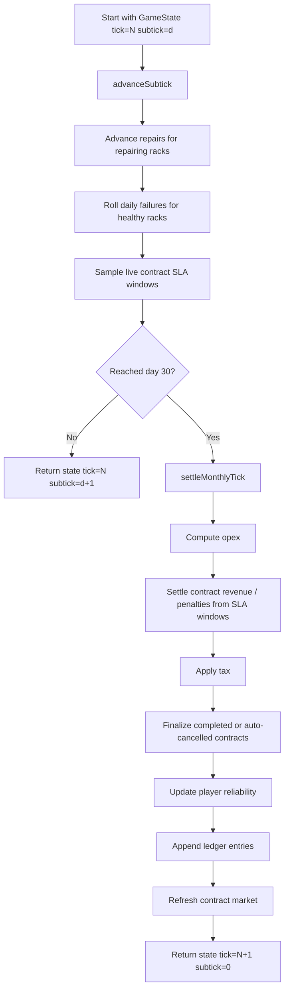

# Core Loop

This document explains the two-layer simulation loop inside `@datacenter-tycoon/game-logic`:

- `advanceSubtick()` in `src/sim/subtick.ts` handles **daily operational state**.
- `settleMonthlyTick()` / `tick()` in `src/sim/tick.ts` handle **monthly financial settlement**.

For the static entity model and module responsibilities, see [`./ARCHITECTURE.md`](./ARCHITECTURE.md).

## What time means

In `game-logic`:

- **1 tick = 1 in-game month**
- **1 subtick = 1 in-game day**
- `DAYS_PER_TICK = 30`

`GameState` persists both values:

- `tick`: completed months
- `subtick`: completed days within the current month, `0..29`

Time advancement can happen either by:

- dispatching `{ type: "Subtick" }` to advance one day,
- dispatching `{ type: "Tick" }` to advance to the next month boundary compatibly, or
- calling `advanceSubtick(state)` / `tick(state)` directly.

## High-level flow



## Daily subtick pipeline

`advanceSubtick(state)` is intentionally lightweight. It performs only work that benefits from day-level fidelity.

### 1. Restore deterministic RNG and process rack maintenance

For every datacenter:

- repairing racks advance by `advanceRackRepair()`
- healthy racks roll one **daily** failure hazard derived from the monthly curve
- any failure records:
  - `health: "repairing"`
  - `repairProgressDays: 0`
  - `lastFailureAtTick`
  - `lastFailureAtSubtick`

The PRNG still comes from persisted `rngState`, so daily failures remain deterministic for the same seed + action history.

### 2. Sample contract SLA windows

After rack health updates, every live contract samples whether its assigned datacenter/fabric pool could serve committed demand for that day.

Each live contract updates a persisted window:

- `sampledDays`
- `servedDays`
- `failedDays`

This means a short outage can consume only a few failed days instead of automatically failing the whole month.

### 3. Advance the day counter or cross the month boundary

- If `subtick + 1 < DAYS_PER_TICK`, return the updated state with the next `subtick`.
- If the boundary is reached, hand the state off to `settleMonthlyTick()` and reset `subtick` to `0` for the new month.

## Monthly settlement pipeline

`settleMonthlyTick(state)` is the heavy month-end path. It should stay monthly-only.

### 1. Advance the month and rebuild canonical contracts

The settlement pass first:

- computes `nextTick = state.tick + 1`
- sets `subtick = 0`
- normalizes contracts through `contractsFromState(state)`

At this point, all daily repair/failure/SLA sampling for the closing month has already happened.

### 2. Compute monthly opex per datacenter

For every datacenter, `tickOpex()` calculates:

- power
- cooling
- bandwidth
- baseline staff wages
- extra maintenance staff wages
- rack maintenance
- tax (added after revenue is known)

This remains monthly because it is comparatively expensive and naturally month-scoped.

### 3. Settle contract revenue and penalties from SLA windows

`tickRevenue()` now evaluates each live contract from its accumulated SLA window instead of a single month-end instantaneous capacity check.

- If `servedDays / sampledDays >= slaTargetPercent`, the contract earns `monthlyPayment` and records a fulfilled SLA outcome.
- Otherwise, the contract is breached, the player pays the difficulty-scaled penalty, and the breach streak increments.
- In both cases, the current SLA window is reset for the next month.

### 4. Apply tax

Tax is still computed per datacenter from that datacenter's monthly revenue minus monthly opex.

### 5. Finalize lifecycle transitions

After the SLA result is known, the settlement pass can still:

- auto-cancel long breach streaks (`CONTRACT_BREACH_AUTO_CANCEL_MONTHS`)
- complete contracts whose term has ended

Those transitions remain month-based.

### 6. Update reliability from the month’s SLA outcomes

The reliability system consumes the `outcomes` produced by `tickRevenue()`:

- fulfilled month: `+3`
- breached month: `-8`
- cancelled contract: `-12`

Reliability is updated before market refresh, so the same month’s SLA results immediately affect future offers.

### 7. Append ledger entries and apply net cash delta

Monthly settlement appends ledger entries in stable order:

1. `opex`
2. either `revenue` or `penalty`

Daily subticks do **not** append ledger entries.

### 8. Refresh the market and rebuild derived contract views

Only after monthly settlement completes does the engine:

- expire stale market offers
- backfill new offers
- rebuild compatibility views (`contractMarket`, `activeContracts`)

Daily subticks do **not** generate new contracts or refresh the market.

## Compatibility semantics for `Tick`

`tick(state)` still means **advance one month**.

- From `subtick = 0`, it advances through the next 30 subticks and settles once.
- From mid-month, it runs only the remaining subticks to the month boundary, then settles exactly one month.

This preserves existing CLI scripts, reducers, and tests that think in month-sized steps.

## What runs daily vs monthly

### Daily (`advanceSubtick`)

- repair progress
- rack failures
- SLA sampling
- day counter progression

### Monthly (`settleMonthlyTick` / `tick`)

- opex
- taxes
- contract revenue / penalties
- breach streak and lifecycle finalization
- reliability updates
- ledger writes
- market expiry / backfill

## Guardrail

If a new system can be described as “this should be observable inside a month,” it probably belongs in `advanceSubtick()`.

If it changes books, market state, taxes, or ledger history only once per month, it belongs in monthly settlement.

## Minimal pseudocode

```ts
function advanceSubtick(state: GameState): GameState {
  const maintenanceState = processDailyRepairsAndFailures(state);
  const sampledState = sampleDailySlaWindows(maintenanceState);

  if (state.subtick + 1 < DAYS_PER_TICK) {
    return { ...sampledState, subtick: state.subtick + 1 };
  }

  return settleMonthlyTick({ ...sampledState, subtick: 0 });
}

function settleMonthlyTick(state: GameState): GameState {
  const nextTick = state.tick + 1;
  const monthlyState = {
    ...state,
    tick: nextTick,
    subtick: 0,
    contracts: contractsFromState(state),
  };

  const opex = computeMonthlyOpex(monthlyState);
  const revenue = tickRevenue(monthlyState); // SLA-window settlement
  const finalizedContracts = revenue.updatedContracts.map(contract =>
    finalizeContract(contract, nextTick)
  );
  const reliability = updatePlayerReliability(monthlyState.player.reliability, revenue.outcomes);

  return refreshContractMarket(
    withDerivedContractViews({
      ...monthlyState,
      player: { ...monthlyState.player, reliability },
      contracts: finalizedContracts,
      ledger: appendMonthlyLedgerEntries(...),
    }),
  );
}
```